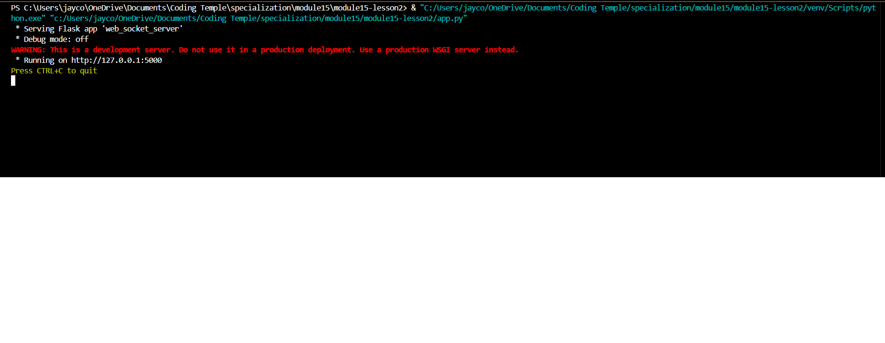

# Mini-Project: Chat Application Project

- Author: Jaycob Hoffman

- Date: 20 February 2025

## Description

This project allows users to create rooms, send messages to other users' rooms, as well as update and delete sent messages. It utilizes Python, HTML, JavaScript, and SocketIO to create a dynamic backend for a chat application.

## Instructions for Use

When users first run the server, the following message will appear within their CLI:

When users open the application, a "chat room" will appear in the browser:

Users can paste the url into a new window to open a second room as shown:

Type a message into the box and hit "Send". The message will broadcast to all chat rooms:

#

View the Chat Application Project [GitHub Repository](https://github.com/JaycobHoffman1/module14-mini-project)